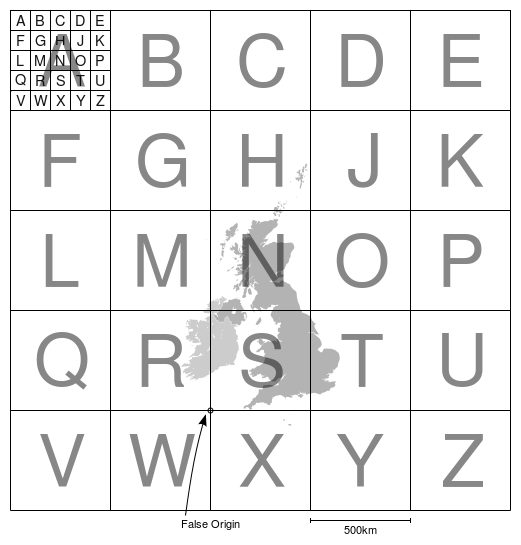
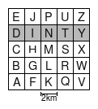

dinty.js
=======

Javascript utilities for converting Ordnance Survey grid references
into cartesian coordinates.

The original intent of this module is for use in mapping botanical and
zoological surveys, which use the grid reference to indicate the
location of a recorded sighting with some deliberately limited
precision given by the size of the grid.  Therefore various length
grid references can be converted to cartesian coordinates with a grid
size.

Synopsis
--------

Coordinates are returned as Javascript objects with numeric attributes
`x`, `y`, and sometimes `precision`. The x, y coordinates returned
indicate the bottom-left corner of the relevant grid square.  The
origin and scale of the coordinates depend on the function.

Usage examples:

    var dinty = require('dinty.js')

    // Convert a DINTY coordinate letter to an XY coordinate
    var coord = dinty.dintyToXY("A") // {x: 0, y, 0}

    // Ditto for a FGHJK coordinate
    coord = dinty.fghjkToXY("A") // {x: 0, y: 4}

    // Convert an Ordinance Survey alphabetical coordinate pair to XY 
    coord = dinty.osAlphaToFalseOriginCoord("G","T")
    // returns {x: 800000, y: 1600000}

    // Convert an OS grid reference into an XY coordinate with 
    // an indication of the precision (grid square size in km)
    coord = dinty.gridrefToFalseOriginCoord("TU12345678")
    // returns {x: 1912340, y: 656780, precision: 10},

Description
-----------

This module is useful for interpreting grid references as used by the
UK's Ordnance Survey.  These use the "FGHJK" lettering schemes for
coarse grained references, with an aritrarily fine cartesian
coordinate system nested within.  An extension to this is supported,
the "DINTY" scheme, which is used by the botanical and zoological
recording systems.

OS Grid references
------------------

To summarise the grid reference scheme:

 * A large scale grid of 5 by 5 500km squares covers the UK and surroundings.

 * These are given the letters A-Z (omitting I), left-to-right, top-to-bottom.

The 500km grid is larger than the National Grid for historical
reasons: it was adopted from pre-existing military grid.  Therefore
many of the squares are empty or outside the scope of the UK. It is
based on the Transverse Mercator Projection.

 * There is a "false origin" defined at the junction of R S W and X.

 * This origin is a point southwest of the British mainland, such that
   all locations in the mainland can be given positive coordinates
   relative to it.

 * Each of the 500km squares is divided into 5 by 5 100km squares.

 * These are lettered in the same way as the 500km squares.

 * Each of these 100km squares are divided up into 10  by 10 10km squares.

 * These are known as "hectads", or sometimes "decads".

 * Hectads are labelled using a cartesian coordinate scheme with
   the origin (0,0) in the bottom left (south west) corner and (9, 9)
   in the top right.
 
Thus VV00 is the grid reference of the hectad in the bottom left,
(south west) or the national grid, and EE99 the one in the top right.

 * Further subdivision of squares into nested 10 by 10 grids can be
   made to arbitrary depths, as you'd expect with a cartesian coordinate
   system.

 * Monads are the 1km grid squares within hecads.

For example, VV000000 is the south-westernmost monad, VV00000000 is
the south-westernmost 100m square, and so on.

DINTY
-----

The DINTY system is a variation on grid references, used by botanical
and zoological recordings.  It uses a 2km scale grid, whose squares
are called "tetrads".

 * In DINTY, grid references for hectads are suffixed with a letter
   indicating a particular tetrad within it.

 * In contrast to the OS lettering scheme, tetrads are labelled with
   the letters A-Z (omitting O), bottom-to-top, left-to-right.

So for example, VV00A is the south-westernmost tetrad.  The second
row, "DINTY" gives the name of the scheme.

See also:

* http://sxbrc.org.uk/biodiversity/recording/ngr.php
* http://www.kmbrc.org.uk/recording/help/gridrefhelp.php?page=1
* https://en.wikipedia.org/wiki/Ordnance_Survey_National_Grid

Functions
---------

See the [API documentation](API.md)

Installation
------------

Install using npm:

    npm install dinty

Or direct from the repository:

    npm install git://github.com/wu-lee/dinty.git

This module follows the CommonJS scheme, as normal for node
modules. If you wish to use this module within a browser, which does
not use CommonJS, the standard way to wrap the module such that it can
be exposed as an attribute of the `window` object is to use
[Browserify](http://browserify.org/), also available on npm.

Tests
-----

Tests live in the `t/` subdirectory, and use the QUnit test
framework. Run them in nodejs with:

    npm test

Issues
------

Please report any bugs or other issues on GitHub.

    https://github.com/wu-lee/dinty/issues

Author
------

Nick Stokoe <github dot wu-lee at noodlefactory dot co dot uk>

Last updated March 2016

